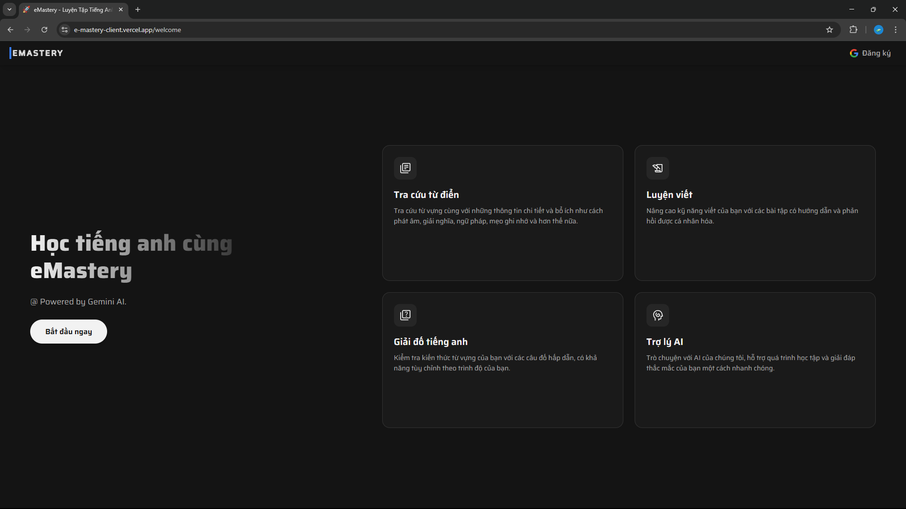
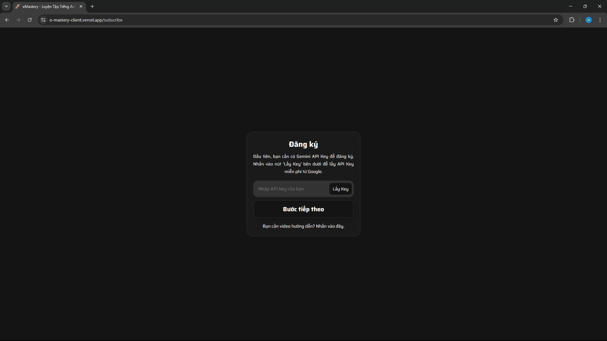
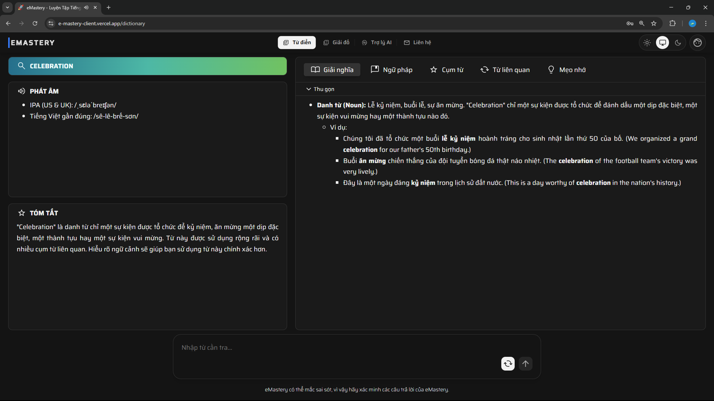
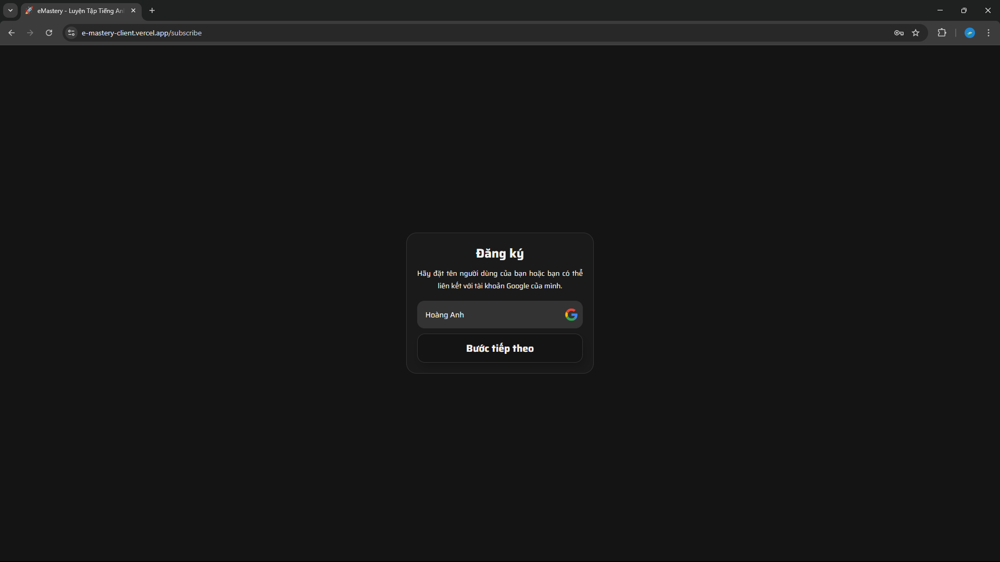
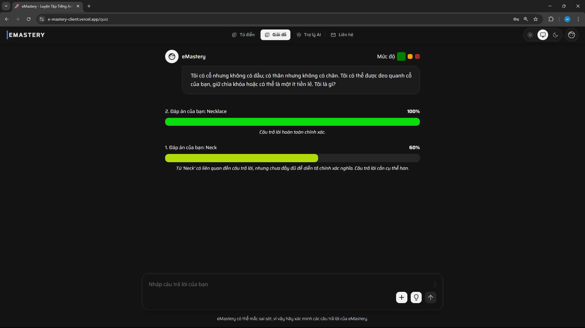
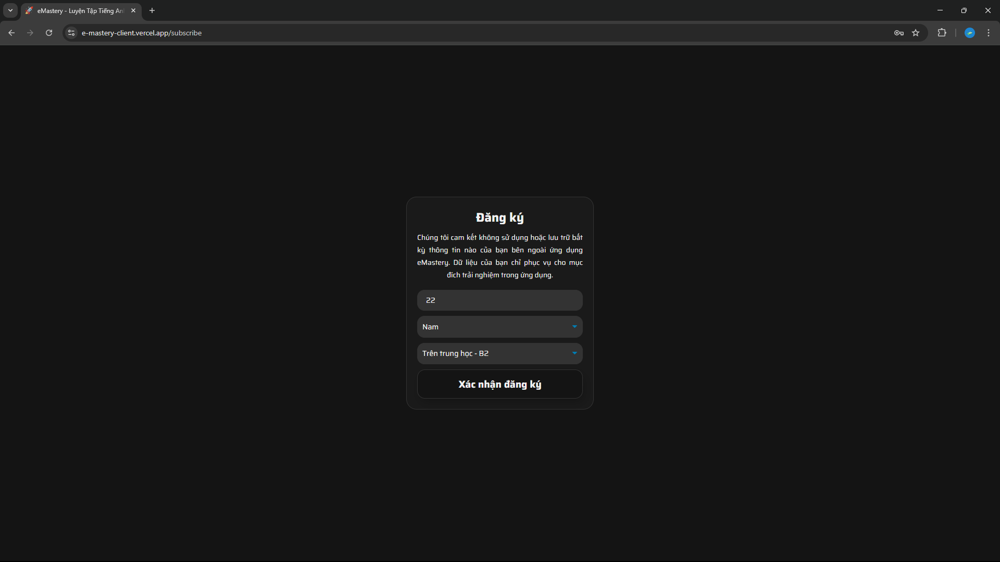
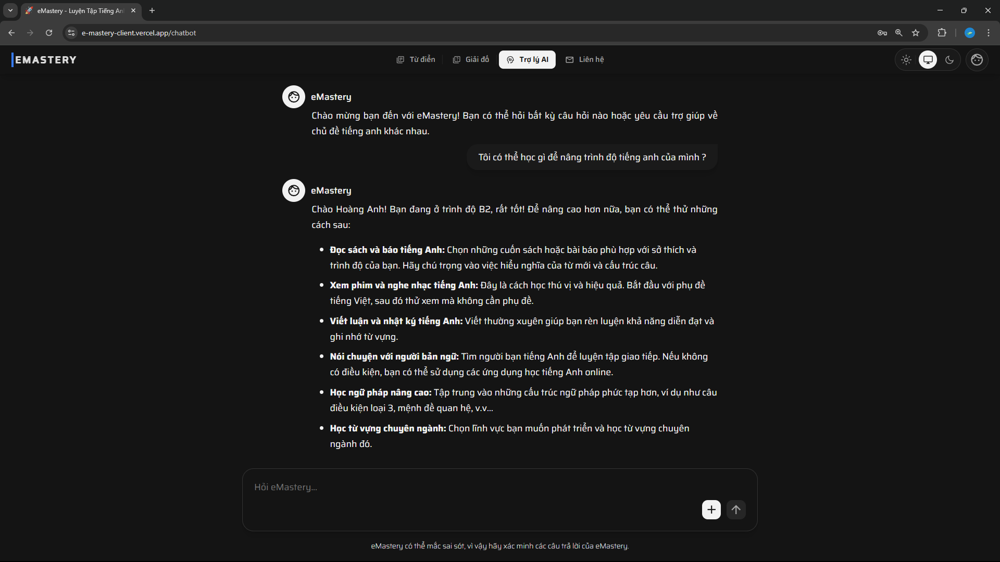

# eMastery - English Learning Support Application (Powered by Gemini AI)

eMastery is a web application powered by **Gemini AI**, offering a smart and modern learning experience. The application helps users improve their language skills through unique learning tools.

## Main Features

* **Chatbot:** Communicate and practice English with an AI that provides intelligent answers and assistance for English learning.
* **English-Vietnamese Dictionary:** Look up vocabulary, view detailed explanations, phonetics, and listen to pronunciations.
* **Quizzes:** Generate vocabulary quizzes based on the user's selected proficiency and level.
* **Multi-language:** The interface supports both Vietnamese and English.
* **Theme Customization:** Allows users to switch between Light and Dark themes.
* **Contact:** A contact form for users to send feedback or request support.

## Interface

| **Welcome & Subscribe Screens** | **Main Interface** |
| :---: | :---: |
|  |  |
| *Welcome Page* | *Homepage* |
|  |  |
| *Step 1: Enter API Key* | *Dictionary Page* |
|  |  |
| *Step 2: Enter Your Name* | *Quiz Page* |
|  |  |
| *Step 3: Enter Other Information* | *Chatbot Page* |

## Technologies Used

| Backend (Server) | Frontend (User Interface) |
| :--- | :--- |
| <ul><li><b>Framework:</b> .NET 8</li><li><b>Language:</b> C#</li><li><b>API:</b> RESTful API</li></ul> | <ul><li><b>Framework:</b> ReactJS (with Vite)</li><li><b>Language:</b> TypeScript</li><li><b>State Management:</b> React Hooks & Context API</li><li><b>Routing:</b> React Router</li><li><b>Styling:</b> CSS3</li><li><b>Multi-language:</b> i18next</li></ul> |

## Team Members

| Member Name | Main Role |
| :--- | :--- |
| [Hoang Anh](https://github.com/HoaqAnh) | UI/UX Design, Fullstack Developer (ReactJS + NestJS). |
| [Thang Nguyen](https://github.com/imthq1) | Backend Developer (.Net), AI Model Fine-Tuning. |
| [Nguyen Duc Thien](https://github.com/nguyenducthienlq1) | Backend Developer (.Net), AI Model Fine-Tuning. |
| [Lee Hovng G.Dai](https://github.com/PeterHovng) | Contributor |

## License

This project is licensed under the **MIT License**. See the [LICENSE](LICENSE) file for details.
